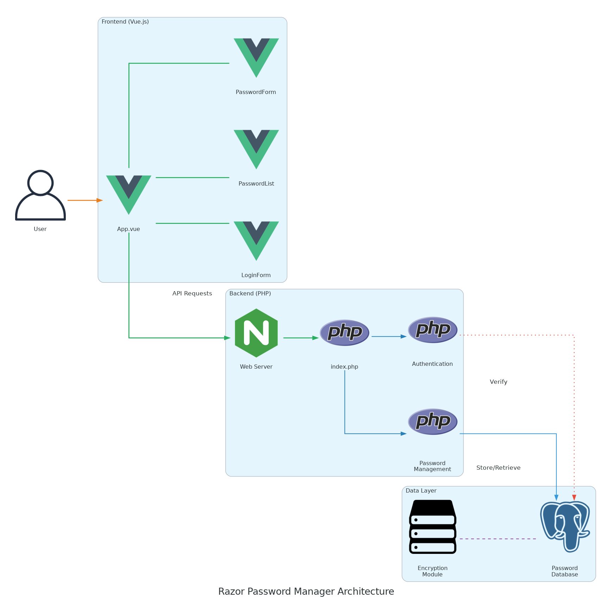
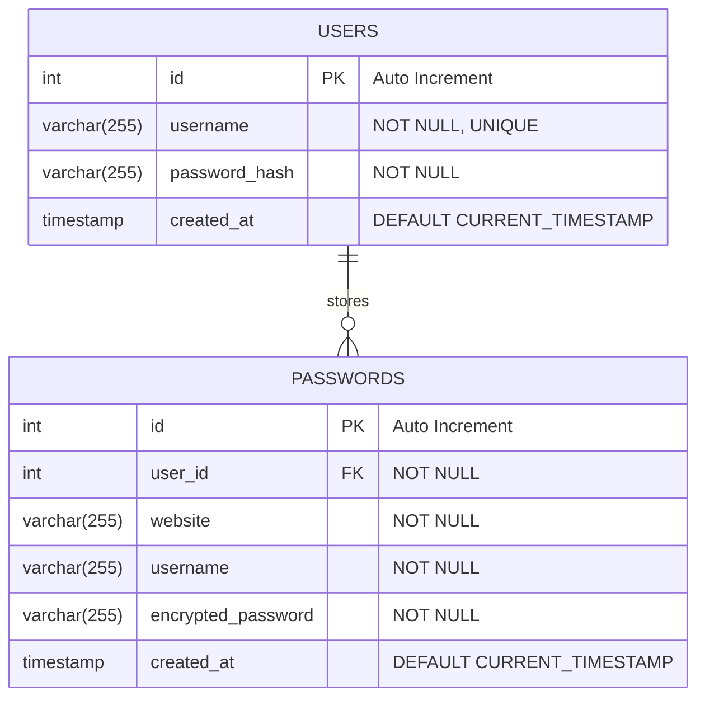

[](https://github.com/gongahkia/razor/releases/tag/1.0.0) 

# `Razor`

Tiny password manager.

Made to practise [the stack](#stack) for my internship. 

## Stack

* [**Frontend**](./razor-app/): Vue.js, Netlify
* [**Backend**](./src/): PHP, Node.js *(for migration in Razor V2.0.0)*
* [**Database**](./src/): SQL, PostgreSQL

## Usage


```console
...
```

## Architecture

### Overview



### DB



## Reference

The name `Razor` is in reference to [Razor](https://hunterxhunter.fandom.com/wiki/Razor) (レイザー), a prominent [Game Master](https://hunterxhunter.fandom.com/wiki/G.I._Game_Masters) from [Greed Island](https://hunterxhunter.fandom.com/wiki/Greed_Island). He emerges as a minor antagonist in the [Greed Island arc](https://hunterxhunter.fandom.com/wiki/Greed_Island_arc) of the ongoing manga series, [HunterXhunter](https://hunterxhunter.fandom.com/wiki/Hunterpedia). `Razor` is also a reference to [Occam's razor](https://en.wikipedia.org/wiki/Occam%27s_razor).

