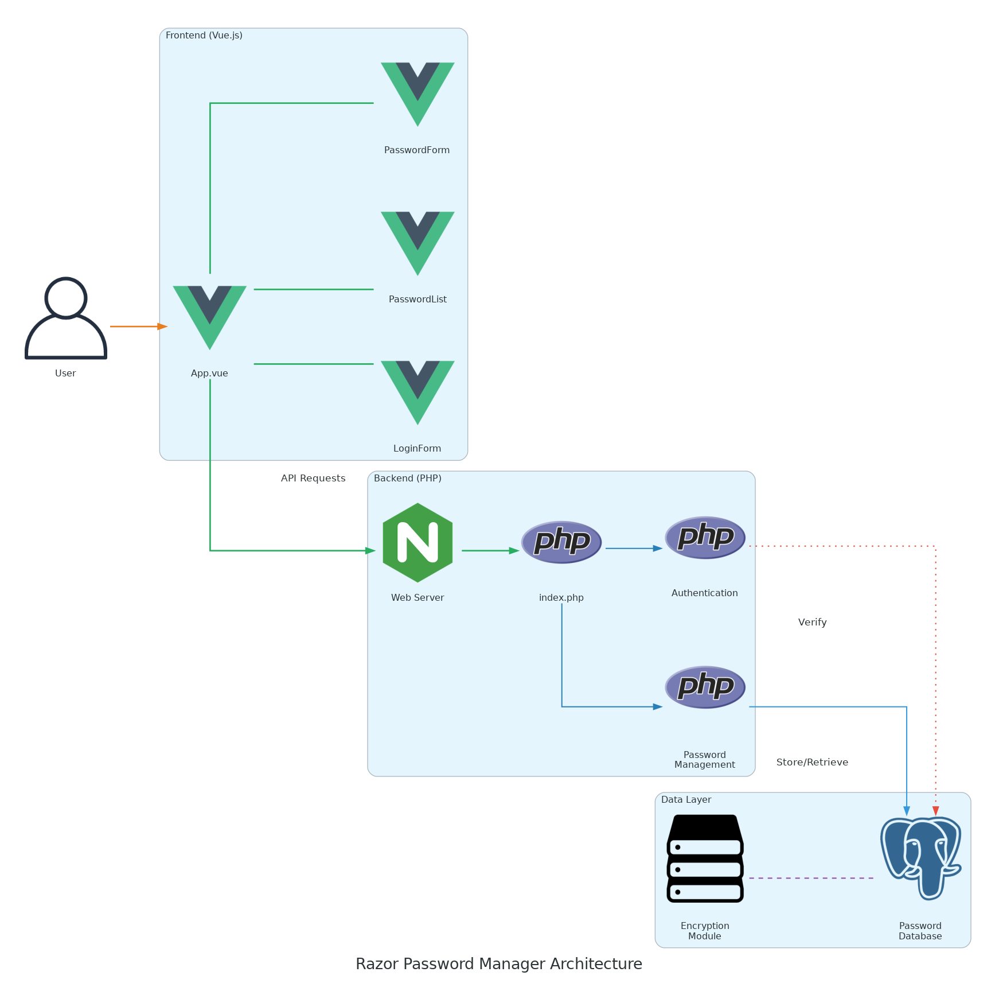
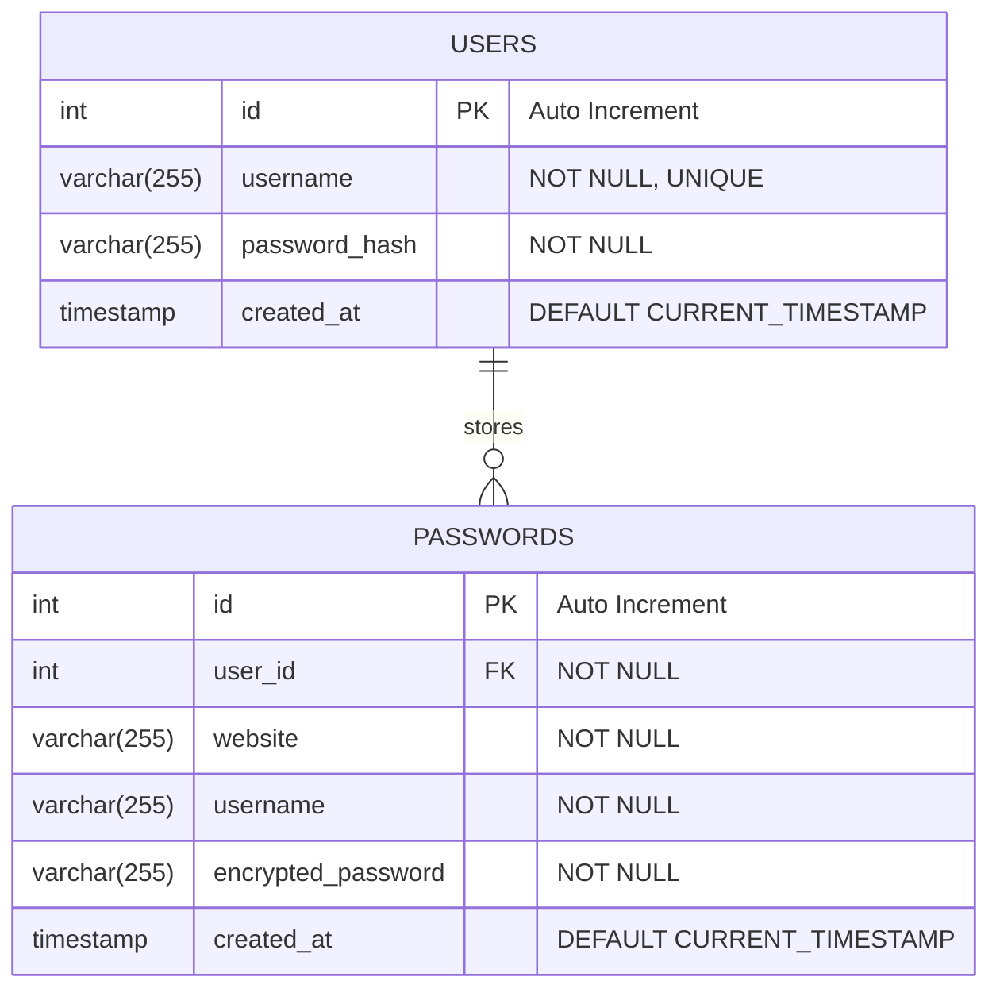
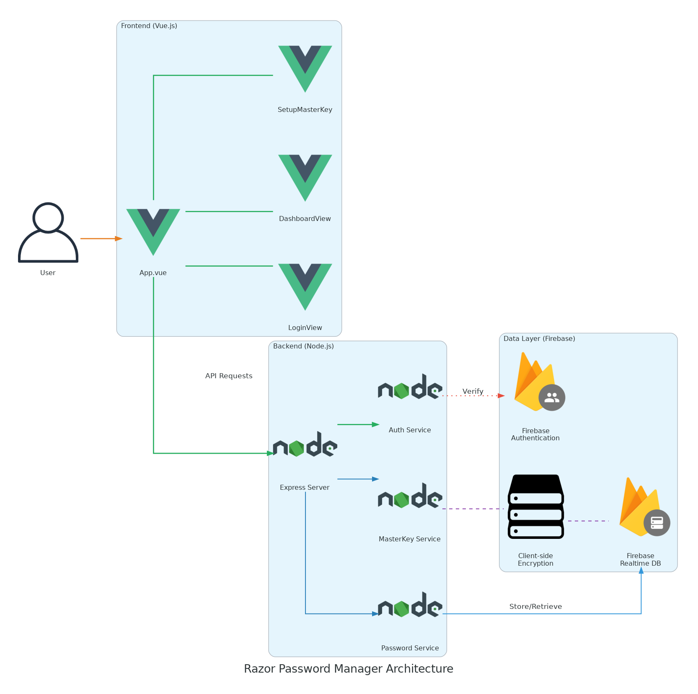
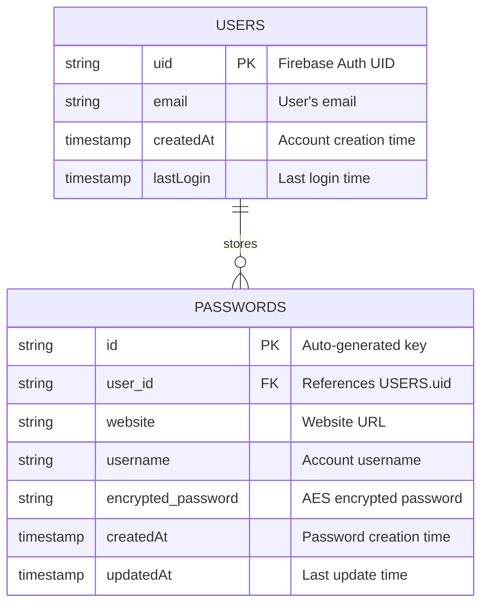

[](https://github.com/gongahkia/razor/releases/tag/1.0.0) 
[](https://github.com/gongahkia/razor/releases/tag/1.0.0) 

# `Razor` 🏐

Simple Full Stack Password Manager Web App.

Made to practise [the stack(s)](#stack) *(and migrating between them)* for my internship. 

## Stack

[`Razor` V1.0.0](#razor-v100)

* [**Frontend**](./razor-app-v1/): Vue.js, Netlify
* [**Backend**](./src/): PHP, AWS EC2
* [**Database**](./src/): SQL, PostgreSQL

[`Razor` V2.0.0](#razor-v200)

* [**Frontend**](./razor-app-v2/): Vue.js, Netlify
* [**Backend**](./src/): Node.js, DigitalOcean Droplets
* [**Database**](./src/): Firebase Realtime Database

## Usage


```console
$ git clone https://github.com/gongahkia/razor
$ sudo service postgresql start
$ psql -U postgres -c "CREATE DATABASE razordb;"
$ psql -U postgres -d razor -f src/backend/db/schema.sql
$ cd/razor-app
$ npm run serve
```

## Architecture

### `Razor` V1.0.0

#### Overview



#### DB



### `Razor` V2.0.0

#### Overview



#### DB



## Reference

The name `Razor` is in reference to [Razor](https://hunterxhunter.fandom.com/wiki/Razor) (レイザー), a prominent [Game Master](https://hunterxhunter.fandom.com/wiki/G.I._Game_Masters) from [Greed Island](https://hunterxhunter.fandom.com/wiki/Greed_Island). He emerges as a minor antagonist in the [Greed Island arc](https://hunterxhunter.fandom.com/wiki/Greed_Island_arc) of the ongoing manga series, [HunterXhunter](https://hunterxhunter.fandom.com/wiki/Hunterpedia). `Razor` is also a reference to [Occam's razor](https://en.wikipedia.org/wiki/Occam%27s_razor).

